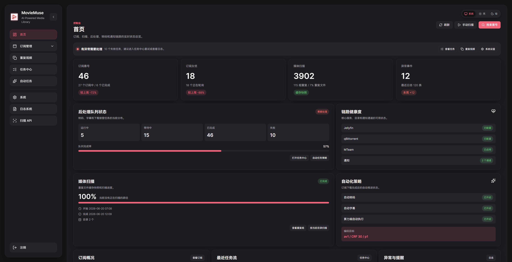
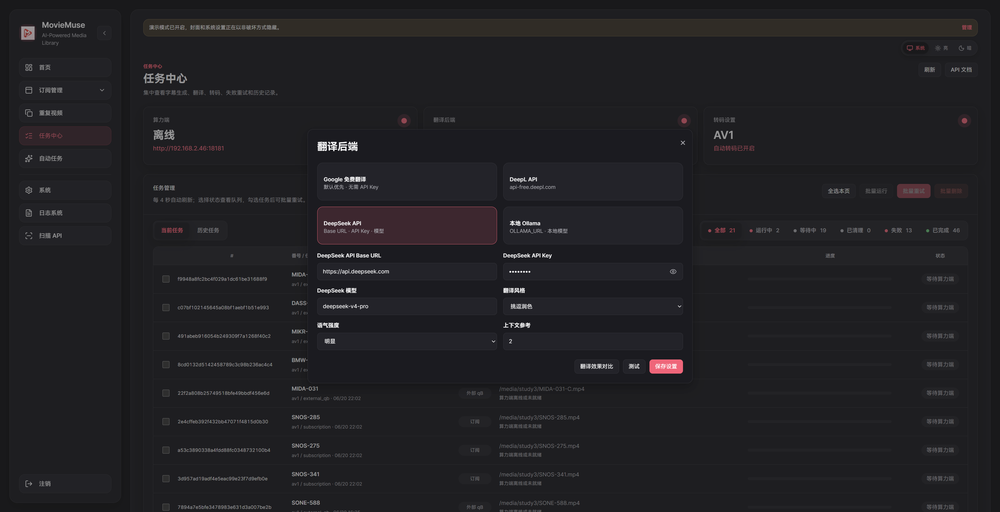
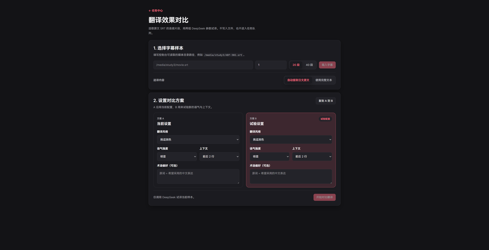
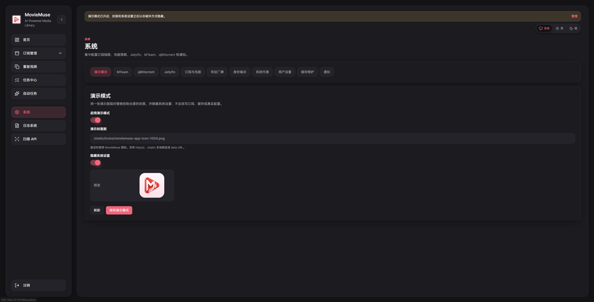

# MovieMuse

MovieMuse 是一个面向 NAS / Unraid 媒体库的整理控制台，重点解决重复视频清理、洗版后处理、字幕生成和字幕翻译这些日常维护问题。

它由两部分组成：Unraid 上运行的 Web 控制台，以及可选的 Windows GPU 算力端。控制台负责扫描媒体库、管理任务和保存配置；Windows 算力端负责使用 `faster-whisper` 生成字幕、执行转码/后处理任务，并把结果回写到媒体目录。

## 实现功能
- [x] 扫描 NAS 媒体目录，按番号/标题识别重复视频和不同版本。
- [x] 管理番号订阅、下载状态、洗版任务和后处理队列。
- [x] 把字幕任务发送到 Windows GPU 主机，用 Whisper / faster-whisper 生成字幕。
- [x] 支持 Google 免费翻译、DeepL API、DeepSeek API、本地 Ollama 等字幕翻译后端。
- [x] 通过浏览器扩展辅助 Jellyfin 页面里的字幕和转码操作（还未上传）

## 项目截图



| 订阅 | 榜单 |
|---|---|
|  |  |

| 效果图 A | 翻译 | 设置 |
|---|---|---|
|  |  |  |

## 需要准备什么

| 项目 | 用途 | 是否必须 |
| --- | --- | --- |
| Unraid 或 Linux Docker 环境 | 运行 MovieMuse Web 控制台 | 必须 |
| Windows GPU 主机 | 运行字幕/转码算力端 | 字幕和转码功能需要 |
| Mteam账号 | 资源搜索拉取唯一途径 | 必须 |
| qBittorrent  / Jellyfin | 下载、洗版、媒体库联动 | 必须 |

推荐目录结构：

```text
/mnt/user/media/
  study3/
  study3_h265/
  trash/

/mnt/user/appdata/moviemuse/
  data/
```

如果 `study3`、`study3_h265`、`trash` 都在同一个媒体根目录下，只需要在正式 yml 里挂载媒体根目录即可：

```yaml
MOVIEMUSE_MEDIA_DIR: /mnt/user/media
```

容器内会自动对应为：

```text
/media/study3
/media/study3_h265
/media/trash
```

## 部署结构

| 端 | 运行位置 | 职责 | 默认端口 |
| --- | --- | --- | --- |
| 控制台 | Unraid Docker | 扫描媒体库、选择移动文件、管理字幕任务和算力端配置 | `18180` |
| 算力端 | Windows GPU 主机 | Whisper 转写、翻译、写入字幕文件 | `18181` |

推荐链路：

```text
Unraid /media 下的视频
    -> MovieMuse 控制台选择任务
    -> Windows Worker 通过共享路径读取视频
    -> 生成同目录 .srt 字幕文件
```

## Docker 部署

### 镜像状态

当前仓库已经加入 GitHub Container Registry 发布流程，后续发布 GitHub Release 时会自动构建并推送：

```text
ghcr.io/jeron-lgy/moviemuse
```

正式部署使用 `deploy/unraid-frontend/docker-compose.release.yml`，从 GHCR 拉取镜像，不需要在 Unraid 上保留完整源码。

| 场景 | Compose 文件 | 镜像来源 | 媒体挂载 | 用途 |
| --- | --- | --- | --- | --- |
| 正式发布 | `deploy/unraid-frontend/docker-compose.release.yml` | `ghcr.io/jeron-lgy/moviemuse` | 默认读写 | 普通用户一键部署 |

### 正式发布部署

首次安装只需要准备一个目录保存 compose 文件和数据目录，例如：

```bash
mkdir -p /mnt/user/appdata/moviemuse
cd /mnt/user/appdata/moviemuse
```

下载[docker-compose.release.yml](https://raw.githubusercontent.com/jeron-lgy/Moviemuse/main/deploy/unraid-frontend/docker-compose.release.yml)

或者复制以下代码：

```yaml
name: moviemuse
services:
  moviemuse:
    image: ghcr.io/jeron-lgy/moviemuse:${MOVIEMUSE_IMAGE_TAG:-latest}
    container_name: moviemuse
    user: "99:100"
    mem_limit: 2g
    memswap_limit: 2g

    ports:
      # 左边是 Unraid 对外 WebUI 端口，冲突时只改左边。
      - "${MOVIEMUSE_HTTP_PORT:-18188}:18180"

    environment:
      MEDIA_DIRS: /media
      TRASH_DIR: /media/trash
      APP_DATA_DIR: /data
      UNRAID_MOUNT_ROOT: /unraid
      UNRAID_TRASH_RELATIVE: media/trash
      MOVIEMUSE_TIMEZONE: Asia/Shanghai
      WHISPER_MODEL: large-v3-turbo
      NO_PROXY: localhost,127.0.0.1,192.168.0.0/16,10.0.0.0/8,172.16.0.0/12
      no_proxy: localhost,127.0.0.1,192.168.0.0/16,10.0.0.0/8,172.16.0.0/12

    volumes:
      # 左边换成你的 Unraid 媒体真实目录。
      - ${MOVIEMUSE_MEDIA_DIR:-/mnt/user/media}:/media
      - ${MOVIEMUSE_DATA_DIR:-/mnt/user/appdata/moviemuse/data}:/data
      # 同盘快速移动需要保留；回收站默认在 /mnt/user/media/trash。
      - /mnt:/unraid

    command: >
      sh -c "umask 022 && uvicorn app.main:app --host 0.0.0.0 --port 18180"

    restart: unless-stopped
```

初始化配置目录权限：

```bash
mkdir -p /mnt/user/appdata/moviemuse/data
chown -R 99:100 /mnt/user/appdata/moviemuse/data
chmod -R u+rwX,g+rwX /mnt/user/appdata/moviemuse/data
```

编辑 `docker-compose.release.yml`，通常只需要确认媒体目录和 WebUI 端口，然后启动：

```bash
docker compose -f docker-compose.release.yml up -d
```

访问控制台：

```text
http://UNRAID-IP:18188
```

### 正式 yml 关键参数

| 参数 | 默认值 | 必填 | 说明 |
| --- | --- | --- | --- |
| `MOVIEMUSE_IMAGE_TAG` | `latest` | 否 | 拉取的镜像标签。正式版本建议固定为 `v0.1.0` 这类版本号。 |
| `MOVIEMUSE_HTTP_PORT` | `18188` | 否 | Unraid 对外 WebUI 端口；容器内固定为 `18180`。 |
| `MOVIEMUSE_MEDIA_DIR` | `/mnt/user/media` | 是 | Unraid 上真实媒体库目录，挂载到容器 `/media`。 |
| `MOVIEMUSE_DATA_DIR` | `/mnt/user/appdata/moviemuse/data` | 是 | 保存设置、任务状态和 SQLite 数据；不要放进媒体目录。 |

Windows 算力端地址、回调地址、路径映射、翻译 API、后处理目录等都在 WebUI 的“字幕任务 / 设置”里维护，不建议写进正式 yml。


### Windows 算力端
release下载zip包

Windows 主机运行：

```text
start_windows_backend.bat
```

默认监听：

```text
http://WINDOWS-IP:18181
```

Windows Worker 只负责提供算力；地址、模型、翻译后端和路径映射在 Unraid 控制台的“字幕任务”页面统一管理。

## 路径映射

算力端必须能够通过 Windows 可访问路径读取 Unraid 视频。例如：

```text
控制台路径：/media/study3/movie.mp4
Windows 路径：\\NAS\media\study3\movie.mp4
```

在控制台的路径映射设置中填写：

```text
/media=\\NAS\media
```

## Whisper 模型

Windows 算力端的模型目录：

```text
data\local-backend\whisper-models
```

推荐先使用：

```text
large-v3-turbo / cuda / float16 / 并发 1
```

追求最高识别质量时可改用：

```text
large-v3 / cuda / float16 / 并发 1
```

低显存或需要兜底时可改用：

```text
medium / cuda / int8_float16 / 并发 1
```

### 新电脑下载模型

新电脑只需要先安装 Python 和 Hugging Face CLI，不需要先安装 MovieMuse 或 CUDA 才能下载模型。

```powershell
winget install Python.Python.3.12
python -m pip install -U huggingface_hub
```

新版 `huggingface_hub` 使用 `hf download`。旧命令 `huggingface-cli download` 已废弃，可能只显示提示但不会下载。

只下载推荐的 turbo 模型：

```powershell
mkdir C:\MoviemuseModels -Force
cd C:\MoviemuseModels

$root = "whisper-models"
mkdir $root -Force

hf download h2oai/faster-whisper-large-v3-turbo `
  --local-dir "$root\large-v3-turbo"
```

一次下载常用三个模型：

```powershell
mkdir C:\MoviemuseModels -Force
cd C:\MoviemuseModels

$root = "whisper-models"
mkdir $root -Force

hf download h2oai/faster-whisper-large-v3-turbo `
  --local-dir "$root\large-v3-turbo"

hf download Systran/faster-whisper-large-v3 `
  --local-dir "$root\large-v3"

hf download Systran/faster-whisper-medium `
  --local-dir "$root\medium"
```
考虑国内不太方便和需要安装 pip 和 huggingface_hub，这里也同步整理了百度云链接。


```text
通过网盘分享的文件：whisper各版本
链接: https://pan.baidu.com/s/1ij5VRQX42GreQS44CSRk4Q 提取码: yu48 
--来自百度网盘超级会员v9的分享
```

下载完成后，模型目录应包含 `model.bin`、`config.json`、`tokenizer.json`、词表文件等。例如：


```text
whisper-models\
  large-v3-turbo\
    config.json
    model.bin
    tokenizer.json
    vocabulary.json
  large-v3\
    config.json
    model.bin
    tokenizer.json
    vocabulary.json
  medium\
    config.json
    model.bin
    tokenizer.json
    vocabulary.txt
```

把整个 `whisper-models` 文件夹复制到 Windows 算力端的：

```text
data\local-backend\whisper-models
```

然后在控制台“字幕任务”页面填写：

```text
模型目录：data\local-backend\whisper-models
模型名：large-v3-turbo
```

模型链接参考：

- [faster-whisper 项目](https://github.com/SYSTRAN/faster-whisper)
- [faster-whisper-large-v3 模型](https://huggingface.co/Systran/faster-whisper-large-v3)
- [faster-whisper-large-v3-turbo 模型](https://huggingface.co/h2oai/faster-whisper-large-v3-turbo)
- [faster-whisper-medium 模型](https://huggingface.co/Systran/faster-whisper-medium)
